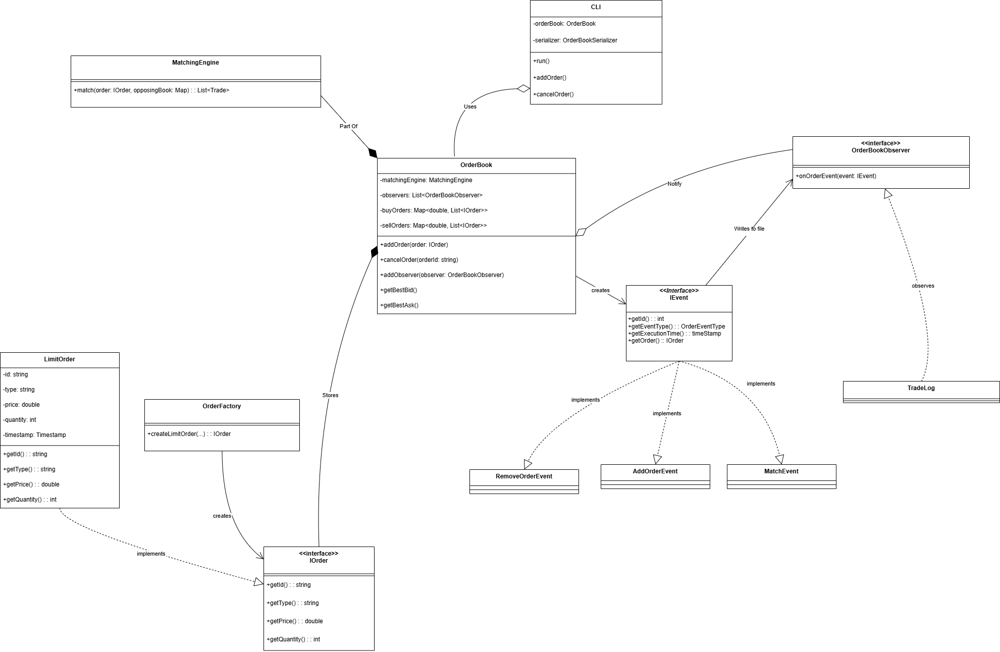

# Design

---

## 1. Core Components

---

### 1.1 `Order`

The Order system uses a polymorphic design: an interface (IOrder) defines the behavior expected of any order, while LimitOrder is the current concrete implementation. This structure allows for future extensibility (e.g., market orders, stop orders).

**Fields:**
- `id`: unique identifier for the order
- `type`: whether the order is a `"BUY"` or `"SELL"` order
- `price`: the price at which the trader is willing to buy/sell
- `quantity`: the number of units in the order
- `timestamp`: time the order was submitted, used for tie-breaking

**Design Notes:**
- `Order` is a lightweight data structure with no internal logic.
- Orders are compared by price, then by timestamp to enforce price-time priority.

---

### 1.2 `OrderBook`

The OrderBook is the core component responsible for storing, organizing, and managing active buy and sell limit orders. It serves as the primary interface for all order-related operations, including addition, cancellation, and matching.

**Responsibilities:**
- Store and manage live buy and sell orders

- Add new orders to the appropriate book (buyBook or sellBook)

- Cancel existing orders by price and order pointer

- Automatically invoke the MatchingEngine upon new order submission

- Notify registered observers (e.g., TradeLog) on state-changing events

- Expose accessor methods to view the current state of the order book (e.g., for CLI display or querying)

**Design Notes:**

- The order book maintains two price levels:

  - buyBook: A std::map<double, std::deque<std::shared_ptr<IOrder>>, std::greater<>>

    - Sorted in descending price order (highest bid first)

  - sellBook: A std::map<double, std::deque<std::shared_ptr<IOrder>>>

    - Sorted in ascending price order (lowest ask first)

- Each price level maps to a deque of orders to enforce time priority (FIFO at each price)

- When an order is added:

  - It is pushed into the appropriate deque under its price

  - A corresponding AddOrderEvent is generated and broadcast to observers

  - The MatchingEngine is invoked to attempt any possible trade(s)

- When an order is cancelled:

  - The specific shared_ptr<IOrder> is removed from its deque

  - Empty deques are pruned from the map

  - A RemoveOrderEvent is dispatched to observers

- Observers are subscribed via the IOrderObserver interface

- Events (IEvent) include AddOrderEvent, RemoveOrderEvent, and TradeEvent, depending on the operation performed

Orders at each price level are stored in a `deque` to preserve insertion order (for timestamp priority).

---

### 1.3 `MatchingEngine`

MatchingEngine encapsulates the logic for matching incoming orders with existing ones in the OrderBook using price-time priority. It is a stateless utility class that returns a list of executed trades and modifies order books by reference.

**Responsibilities:**

- Compare a new buy order with the lowest-priced sell orders (where ask ≤ bid)

- Compare a new sell order with the highest-priced buy orders (where bid ≥ ask)

- Execute full or partial matches based on available quantities

- Remove fully filled orders and clean up empty price levels

 -Return a list of TradeEvent objects for downstream processing (e.g., logging)


**Design Notes:**
- MatchingEngine::match() is a static function taking in:

- An incomingOrder

- References to buyBook and sellBook

- Matching is triggered from OrderBook::addOrder()

- Partial fills are supported: a single incoming order may match against multiple opposing orders

- After each match:

  - reduceQuantity() is called on both orders

  - Fully filled orders are removed from their respective price levels

  - Empty price levels are cleaned up from the order book

- Matching results are returned as a list of TradeEvent instances to be passed to observers like TradeLog

--- 

### 1.4 `Event`

`Event` system models discrete, state-changing operations occurring within the order book. These are used to communicate important actions to observers such as the TradeLog.

- Types of Events:

  - `AddOrderEvent`: Represents the addition of a new order to the book.

  - `RemoveOrderEvent`: Represents the cancellation or complete fulfillment of an order.

  - `TradeEvent`: Represents a successful match between a buy and a sell order.

**Design Notes:**

- All event types inherit from a common IEvent interface.

- Each event captures relevant information such as involved order(s), quantities, and timestamps.

- Events are passed to all registered observers via the observer pattern.

- The Event system decouples core logic from logging and external systems, improving modularity.

---

### 1.5 `TradeLog`

`TradeLog` serves as a persistent, append-only record of all operations performed on the order book — including order additions, cancellations, and matches.

**Responsibilities:**
- Record every significant event that alters the state of the order book
    - `add` → when a new order is submitted
    - `cancel` → when an order is removed
    - `match` → when a trade is executed
- Serialize each event into a structured format and append to a log file in real time
- Maintain a real-time, file-backed audit trail for debugging, recovery, and analytics

**Format:**
- Entries are saved in a structured, machine-readable format such as JSON Lines (JSONL)
- Example (JSONL):
  ```json
    {"type": "add", "order_id": "A101", "side": "BUY", "price": 100, "quantity": 5, "timestamp": "2025-07-03T15:45:00Z"}
    {"type": "match", "buy_id": "A101", "sell_id": "B102", "price": 100, "quantity": 3, "timestamp": "2025-07-03T15:45:01Z"}
    {"type": "cancel", "order_id": "A103", "side": "SELL", "price": 105, "quantity": 2, "timestamp": "2025-07-03T15:45:02Z"}

**Design Notes:**

- Operates via the Observer pattern, listening to IEvent notifications from the OrderBook

- Uses RAII and std::ofstream to ensure safe and consistent file access

- Ensures append-only writes for traceability and simplicity


---


## ## 2. Flow of Operations

---

### 2.1 Submitting a New Order

1. A user issues a command via the CLI to place a new buy or sell order.
2. The `OrderFactory` constructs a `LimitOrder` implementing `IOrder`, assigning a unique ID and timestamp.
3. The new order is added to the correct side of the `OrderBook` (buy or sell map).
4. An `AddOrderEvent` is created and dispatched to all observers (e.g., `TradeLog`).
5. The system immediately invokes the `MatchingEngine` to attempt matching the new order.

---

### 2.2 Matching Orders

6. The `MatchingEngine` compares the new incoming order against resting orders on the opposite side of the book.
7. If the incoming order satisfies price-time priority conditions:
    - One or more trades (`TradeEvent`) are generated and executed.
    - Matched quantities are subtracted from both sides.
    - Any order with `quantity == 0` is removed from the book.
    - Empty price levels are also cleaned up.
8. Each match results in a `TradeEvent`, which is propagated to all observers (e.g., logged by `TradeLog`).

---

### 2.3 Recording Events

9. Every event that modifies the state of the `OrderBook` — such as:
    - **AddOrderEvent** (on order submission),
    - **RemoveOrderEvent** (on cancel or full match),
    - **TradeEvent** (on partial or full match),
      — is passed to the `TradeLog`, which appends it to a persistent file (e.g., JSON Lines format).

---

### 2.4 Querying the Book

10. Users can query the system via CLI at any time to view the current order book state.
11. The `OrderBook` exposes getters for buy/sell sides, sorted by price, to support real-time display or testing.

---

### 2.5 Canceling Orders

12. A user may issue a cancel command via CLI, supplying the order ID.
13. The `OrderBook` searches for the order in the buy/sell maps and removes it if found.
14. A `RemoveOrderEvent` is dispatched to all observers, and the cancellation is logged.

---

### 2.6 System Exit

15. On exit, no snapshot is saved.
16. The system can be restarted fresh — current design does not support recovery from persistent state.


## 3. Persistence Model

This section describes how the system ensures data durability and traceability using an append-only event log model.

### 3.1 Overview

The system uses a single persistence mechanism:
- **TradeLog**: A real-time, append-only log of all events (`AddOrderEvent`, `RemoveOrderEvent`, `TradeEvent`) for auditability, traceability, and potential replay.

This model is simple, robust, and suitable for environments that do not require snapshot-based recovery.

---

### 3.2 Trade Log (Event Journal)

- Every state-changing event (order added, matched, canceled) is immediately passed to the `TradeLog`.
- The `TradeLog` serializes these events into a persistent file (e.g., `log.jsonl`).
- The format is machine-readable (JSON Lines), allowing the log to be consumed by analytics tools or replay engines.
- Example entries:
  ```json
  {"type": "add", "order_id": "123", "side": "BUY", "price": 100, "quantity": 5, "timestamp": ...}
  {"type": "match", "buy_id": "123", "sell_id": "124", "price": 100, "quantity": 3, "timestamp": ...}
  {"type": "cancel", "order_id": "125", "timestamp": ...}

## 4. Design Principles Applied

This project is built with long-term maintainability, extensibility, and correctness in mind. The following key software design principles are actively applied:

### 4.1 SOLID Principles

- **Single Responsibility Principle (SRP):**  
  Each class has a focused, well-defined purpose:
    - `OrderBook` manages live orders and coordinates matching
    - `MatchingEngine` performs price-time matching logic
    - `TradeLog` handles event logging
    - `OrderBookSerializer` manages persistence and recovery

- **Open/Closed Principle (OCP):**  
  Matching strategies can be extended or swapped (e.g., pro-rata matching) without modifying `OrderBook` logic.

- **Liskov Substitution Principle (LSP):**  
  Future abstractions (e.g., interfaces for loggers or matching engines) will allow polymorphism without breaking functionality.

- **Interface Segregation Principle (ISP):**  
  Interfaces are kept minimal and focused (e.g., `OrderBookSerializer` does not expose `TradeLog` internals).

- **Dependency Inversion Principle (DIP):**  
  High-level modules (e.g., CLI, controller) depend on abstractions like `OrderBook`, not on file or I/O specifics.

---

### 4.2 C++-Specific Principles

- **RAII (Resource Acquisition Is Initialization):**  
  Memory and file management are wrapped in RAII-safe classes (`std::vector`, `std::ofstream`, `smart pointers`), ensuring deterministic cleanup.

- **Rule of 5 / Rule of 0:**  
  Custom constructors and destructors are only written when needed. Most types follow the Rule of 0 by relying on STL and smart pointers.

- **Const-Correctness:**  
  Read-only methods are marked `const` to enforce immutability and avoid accidental state changes.

- **Separation of Interface and Implementation:**  
  Public interfaces are declared in header files (`.hpp`), while logic resides in implementation files (`.cpp`), improving build hygiene.

---

### 4.3 Architectural Design Patterns

- **Composition over Inheritance:**  
  Components like `OrderBook`, `TradeLog`, and `MatchingEngine` are composed, not subclassed, for better encapsulation.

- **Strategy Pattern (planned):**  
  Matching logic is isolated to enable runtime or compile-time switching of order matching strategies.

- **Snapshot + Event Log Model:**  
  Combines fast snapshot-based recovery with fine-grained TradeLog replayability, inspired by event sourcing architectures in distributed systems.

---

## 5. Design Choices

The following design choices were deliberately made to balance simplicity, maintainability, and extensibility:

### 5.1 Use of Interfaces and Factory Pattern
- **Rationale:** Interfaces (`IOrder`, `OrderBookObserver`) ensure flexibility, allowing for future enhancements such as different types of orders (market, stop-loss) or observers (analytics, notifications).
- **Factory Pattern:** `OrderFactory` was used to centralize and encapsulate order creation logic, ensuring consistent validation, ID generation, and timestamping.

### 5.2 Observer Pattern
- **Rationale:** Implementing the observer pattern with `OrderBookObserver` allows for loose coupling between `OrderBook` and its observers (`TradeLog`, `OrderBookSerializer`). This supports easy addition of new observers and improves system modularity.

### 5.3 Composition and Aggregation
- **Composition:** `OrderBook` has strong ownership of `Orders` and `MatchingEngine`, clearly defining lifecycle management.
- **Aggregation:** CLI aggregates (uses but does not own) the `OrderBook` and `OrderBookSerializer`, allowing clear separation between user interaction logic and domain logic.

### 5.4 Persistence Strategy
- **Snapshot and Log:** A dual persistence strategy combining an append-only event log (`TradeLog`) and periodic state snapshots (`OrderBookSerializer`) was chosen to balance performance, recovery speed, and auditability. This design ensures quick recovery after crashes without sacrificing detailed event tracking.

### 5.5 Simplicity and Modularity
- The design avoids over-engineering by choosing straightforward, easily testable designs (such as limiting inheritance, using clear aggregation, and employing simple DTOs like `Trade`).

These decisions collectively support the project’s stated goals of clarity, extensibility, maintainability, and robust recovery capabilities.

### 5.6 Class Diagram



---

# 6. Future Work

This project is designed with extensibility in mind. Potential enhancements include:

- Support for market and stop-loss orders
- Customizable matching strategies (e.g., pro-rata, FIFO overrides)
- Multithreaded order book engine
- Real-time data feed integration
- HTTP/REST API for remote interaction
- Interactive TUI or GUI interface for order monitoring
- Persistent storage via a database backend (e.g., SQLite or PostgreSQL)

