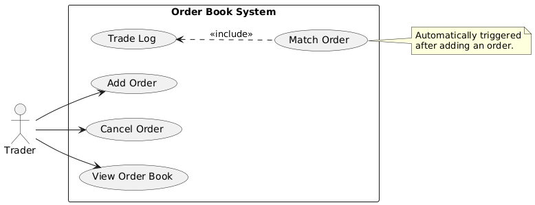

#  Requirements Document

 ---

## 1. Functional Requirements

The system must support the following core operations:

- Add a limit buy/sell order
- Cancel an existing order by ID
- Match orders based on price-time priority
- Display the current state of the order book
- Log trades that were matched
- Serialize order book state to file

---

## 2. Non-Functional Requirements

- Language Standard: Written in modern C++ (C++20 or later)
- Best Practices: Applies STL, RAII, templates, and object-oriented principles
- Code Structure: Organized into modular components under `src/`, `include/`, and `test/`
- Testing: Thoroughly unit tested using Catch2
- Build System: Built with CMake for cross-platform support
- Memory Safety: Verified to be free of memory leaks via sanitizers or manual inspection

---

## 3. Assumptions and Constraints

- System runs on Linux/Windows with C++20 support
- Single-user usage model 
- No external dependencies except C++ STL and Catch2

---

## 4. Use Case Diagram

